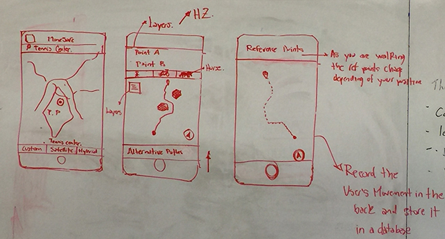

# MineSafe Application Development Plan

## Team: Carlos Bautista Asiza and Robert Hieger

### Project Concept Sketches:

### User Stories

| User Story | Description |
|:---------- |:----------- |
| User can start navigation.  | Determine reference points to display on the next steps according to user's position on map. |
| As a user, I can choose a destination. | Load map showing user's current location. Provide auto-complete based on previous interactions.  |
| As a user, I can navigate to my destination. | Provide guidance and orientation to user as she or he walks; emit warning signal if user is getting too close to danger zone. |
| As a user, I can see my path. | Show user path from position of origin to destination. |
| As a user, I can see danger zones. | Show danger zones on map based on data from data store (perhaps SQLite or JSON). |
| ~~User can specify mode of travel.~~[^1] | ~~Calculate times; define the safest path for each mode (walking, bike, horse); get data from database for display.~~ |
| ~~As a user, I can see how long my trip will take.~~[^2] | ~~Display estimated time trip will take (feasibility TBD).~~ |
| ~~As a user, I can see how many others have safely taken my path in the past.~~[^3] | ~~Display number of safe trips taken on this path.~~ |

[^1]: This feature is a wishlist item that may be deleted from the final feature set of the application.

[^2]: Ibid.

[^3]: Ibid.

### Required Modules

| Required Module | Purpose |
|:--------------- |:------- |
| **Mapbox Framework** | Provides overall mapping functionality to application. |
| **MinePathViewController.swift** | Controls presentation of opening view to choose destination. |
| **alternateModeViewController.swift** | Controls view for selection of alternate paths. |
| **pathTrackViewController.swift** | Controls view of progress along path. |
| **destinationPath.swift** | Class to interface with SQLite database containing pre-defined paths. |
